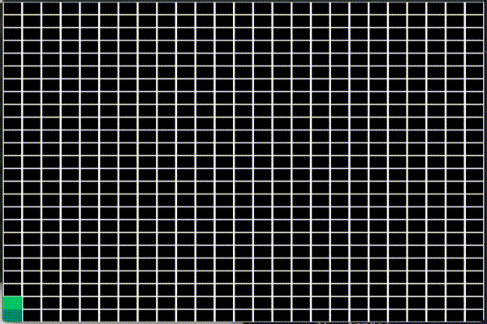

# maze-generator

Implementation of a maze generating algorithm in badly written python

Using Python Arcade with a depth-first search + recursive backtracker algorithm. See: https://en.wikipedia.org/wiki/Maze_generation_algorithm

